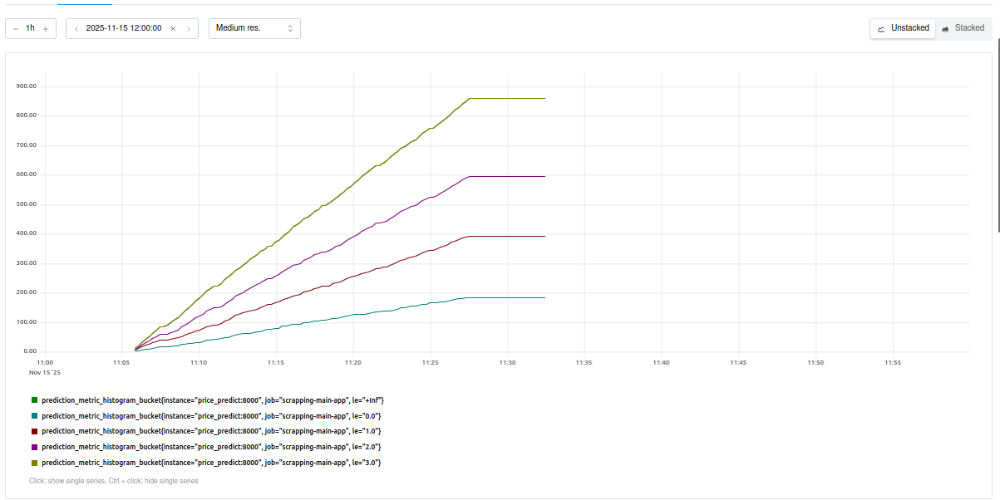
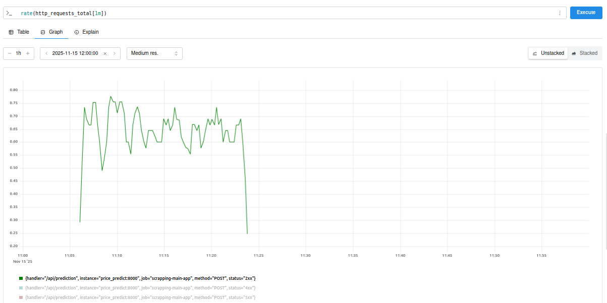
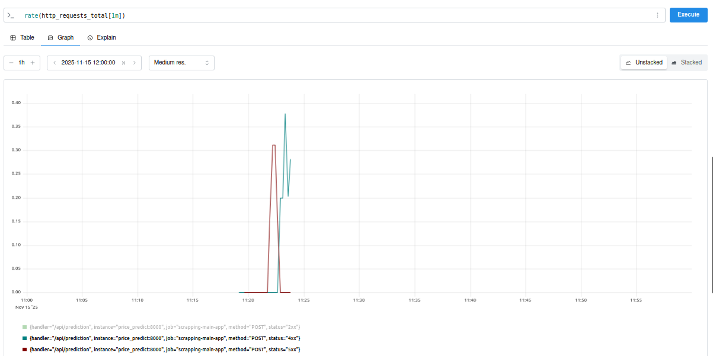
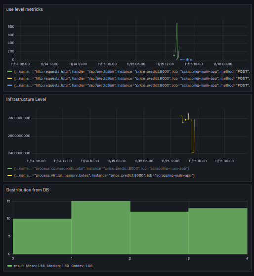

# Описание проекта
Проект посвящен решению задачи классификации мобильных устройств по стоимости
на основании датасета https://www.kaggle.com/datasets/iabhishekofficial/mobile-price-classification/data
В проекте использованы библиотеки scikit-learn и catboost для машинного обучения, применены autofeat, mlxtend и optuna для улучшения параметров классификации, а также настроен веб-интерфейс с api с использованием mlflow, fastapi, uvicorn, prometheus, grafana и PostgreSQL.

# Запуск
Для запуска проекта необходимо выполнить команды:
```
git clone https://github.com/LvovMD/IIS_Labs.git
cd lab_project
python -m venv .lab_venv
source ./.lab_venv/bin/activate
pip install -r requirements.txt

```
# Исследование данных

Находится в `./eda/eda.ipynb`. Основные результаты:

В ходе исследования были проведены действия:
* Удалены записи с нулевым или отрицательным размером экрана
* Основные столбцы датасета проверены на валидность - данные не противоречивы
* Для столбцов 'battery_power', 'mobile_wt', 'px_height', 'px_width', 'ram', 'fc', 'int_memory', 'n_cores', 'pc', 'sc_h', 'sc_w', 'talk_time' изменен тип данных на int16
* Для столбцов 'clock_speed', 'm_dep' изменен тип данных на float16
* Для столбцов 'blue', 'dual_sim', 'four_g', 'three_g', 'touch_screen', 'wifi', 'price_range' установлен категориальный тип данных
* Был сформирован новый признак - `high_speed_ethernet` - доступ устройства к высокоскоростным стандартам Интернет-соединения.
* Был сформирован новый признак - `screen_size` - совокупный размер экрана устройства (в см).

В ходе анализа были выявлены следующие закономерности: 
* Размер батареи информативен для определения категории стоимости (см график `./eda/graph2.png`)
* Большинство особых функций связи мало информативны для классификации (см графики `./eda/graph3-5.png`)
* Числовые признаки мало зависимы друг от друга, что не позволяет снизить их размерность (кроме размеров экрана и модуля камеры).(см график `./eda/graph1.png`)

Обработанная выборка сохранена в файл `./data/clean_data.pkl`

# Настройка и обучение модели
Для настройки модели используется MLFlow

Для запуска выполнить скрипт (находится в папке ./mlflow)
```
sh start_mlflow.sh

```
Исследования находятся в файле `./research/research.ipynb`

Лучшая модель получена в с помогщью CatboostClassifier, RFE и Optuna Search
`run_id = 08cfd1ee98cf442d91df8687db1aaea8` 
Она показывает следующие результаты
precision: 0.9210790773157267,
recall: 0.9216198957578268,
f1_score: 0.9212442875986313,
roc_auc: 0.9954045175474214
В ней выбраны следующие столбцы:
'ram', 'ram', 'ram*sc_h', 'px_width*ram', 'px_height*ram', 'sqrt(n_cores)*ram', 'battery_power*ram', 'ram*log(int_memory)', 'battery_power*px_width', 'battery_power*px_height', 'ram*log(talk_time)', 'sqrt(clock_speed)*ram'
С помощью Optuna Search выделены следующие гиперпараметры (за 20 прогонов):
'depth': 5, 'n_estimators': 150, 'learning_rate': 0.08491529648591742

# Создание сервисов

Создан сервис API для облегчения доступа к результатам классификации.
В папке ml_service содержатся основные скрипты, описывающие работу сервиса: main.py - основная логика веб-сервера, api_handler - непосредственно работа с моделью, а также образ Dockerfile для создания контейнера.
В папке models должна содержаться непосредственно сама модель model.pcl в формате Pickle, а также get_model.py - скрипт для ее извлечения из MLFlow

Для создания образа необходимо использовать следующую команду:
```
docker build . --tag mobile_price_model:1

```

Для запуска контейнера необходимо использовать следующую команду:
```
docker run -p 8001:8000 -v $(pwd)/../models:/models mobile_price_model:1

```

Для проверки работоспособности сервиса необходимо перейти на следующий адрес в браузере:
```
http://localhost:8000/docs

```
Пример json-строки запроса для проверки:
```
{
 "blue": 1,
 "dual_sim": 1,
 "four_g": 0,
 "three_g": 0,
 "touch_screen": 1,
 "wifi": 0,
 "battery_power": 1043,
 "clock_speed": 1.8,
 "fc": 14,
 "int_memory": 5,
 "m_dep": 0.1,
 "mobile_wt": 193,
 "n_cores": 3,
 "pc": 16,
 "px_height": 226,
 "px_width": 1412,
 "ram": 3476,
 "sc_h": 12,
 "sc_w": 7,
 "talk_time": 2
}

```

Пример возвращаемого значения:
```
{
  "price_range": "[3]",
  "item_id": "1"
}

```

Создан сервис аналитики на основе prometheus для оценки результатов предсказания и функционирования основного сервиса. Скрипт, описывающий его работу, содержится в папке prometheus. Сервис может быть достигнут через веб-интерфейс по адресу 127.0.0.1:9090.

Примеры результатов работы сервиса prometheus:




Созданы сервисы pgadmin и database для работы с базой данных на основе PostgreSQL для хранения данных, проходящих через сервис. В соответствующих папках находятся данные СУБД и непосредственно базы данных. База данных состоит из двух таблиц, в таблицу mobile_stats сохраняются данные всех входящих запросов, а в таблицу mobile_predictions - результаты классификации. Сервис может быть достигнут через веб-интерфейс по адресу 127.0.0.1:9091.

Создан сервис grafana для сбора и визуализации результатов работы сервиса и его оценки по различным показателям. Сервис может быть достигнут через веб-интерфейс по адресу 127.0.0.1:3000.

Пример результатов работы сервиса prometheus:


На данном дашборде совместно представлены гистограмма распределения с оценкой базовых статистик, частота запросов, успешных и завершенных с ошибкой, а также некоторая тахническая информация о работе сервиса: объем занятой памяти и загрузка ЦПУ.

Запуск сервиса производится через файл с помощью следующей команды:
```
docker compose up

```